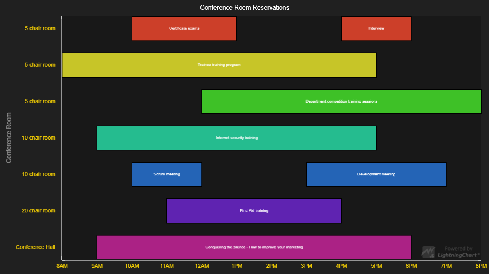

# Span Chart



This demo application belongs to the set of examples for LightningChart JS, data visualization library for JavaScript.

LightningChart JS is entirely GPU accelerated and performance optimized charting library for presenting massive amounts of data. It offers an easy way of creating sophisticated and interactive charts and adding them to your website or web application.

The demo can be used as an example or a seed project. Local execution requires the following steps:

- Make sure that relevant version of [Node.js](https://nodejs.org/en/download/) is installed
- Open the project folder in a terminal:

        npm install              # fetches dependencies
        npm start                # builds an application and starts the development server

- The application is available at *http://localhost:8080* in your browser, webpack-dev-server provides hot reload functionality.


## Description

*Also known as a Range Bar, Column Graph, Floating Bar Graph, Difference Graph, High-Low Graph*

This example shows creation of a Span Chart made on user side by utilizing RectangleSeries. Span Charts display categorized value ranges - focusing only on the extreme values. Each category can have multiple 'spans'.

Here's the creation of a Span Chart using a pre-defined interface.

```javascript
// Create Chart.
const chart = spanChart()
// Add categories.
const tools = chart.addCategory('Tools')
const fools = chart.addCategory('Fools')
// Add spans as min-max.
tools.addSpan(100, 150)
fools.addSpan(50, 75)

// Adding a span returns the actual Figure that represents it, which can be styled.
fools.addSpan(200, 250)
    .setFillStyle(new SolidFill().setColor(prettyColor))
    .setStrokeStyle(emptyLine)
```

The actual Span Chart logic just serves to provide a starting point for users to create their own API based on their needs and preferences. The functionality can be easily extended to construct ***Gantt Chart***.


## API Links

* [XY cartesian chart]
* [Rectangle series]
* [Axis]
* [Empty TickStyle]
* [Solid FillStyle]
* [Empty FillStyle]
* [Solid LineStyle]
* [Empty LineStyle]
* [RGBA color factory]
* [Color palettes]


## Support

If you notice an error in the example code, please open an issue on [GitHub][0] repository of the entire example.

Official [API documentation][1] can be found on [Arction][2] website.

If the docs and other materials do not solve your problem as well as implementation help is needed, ask on [StackOverflow][3] (tagged lightningchart).

If you think you found a bug in the LightningChart JavaScript library, please contact support@arction.com.

Direct developer email support can be purchased through a [Support Plan][4] or by contacting sales@arction.com.

[0]: https://github.com/Arction/
[1]: https://www.arction.com/lightningchart-js-api-documentation/
[2]: https://www.arction.com
[3]: https://stackoverflow.com/questions/tagged/lightningchart
[4]: https://www.arction.com/support-services/

© Arction Ltd 2009-2020. All rights reserved.


[XY cartesian chart]: https://www.arction.com/lightningchart-js-api-documentation/v3.0.1/classes/chartxy.html
[Rectangle series]: https://www.arction.com/lightningchart-js-api-documentation/v3.0.1/classes/rectangleseries.html
[Axis]: https://www.arction.com/lightningchart-js-api-documentation/v3.0.1/classes/axis.html
[Empty TickStyle]: https://www.arction.com/lightningchart-js-api-documentation/v3.0.1/globals.html#emptytick
[Solid FillStyle]: https://www.arction.com/lightningchart-js-api-documentation/v3.0.1/classes/solidfill.html
[Empty FillStyle]: https://www.arction.com/lightningchart-js-api-documentation/v3.0.1/globals.html#emptyfill
[Solid LineStyle]: https://www.arction.com/lightningchart-js-api-documentation/v3.0.1/classes/solidline.html
[Empty LineStyle]: https://www.arction.com/lightningchart-js-api-documentation/v3.0.1/globals.html#emptyline
[RGBA color factory]: https://www.arction.com/lightningchart-js-api-documentation/v3.0.1/globals.html#colorrgba
[Color palettes]: https://www.arction.com/lightningchart-js-api-documentation/v3.0.1/globals.html#colorpalettes

